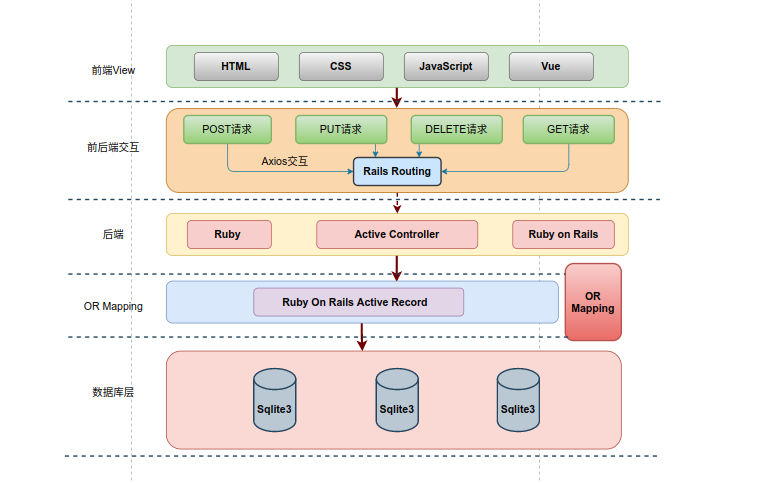

# YiFoo_Market_Backend
Buaa YiFoo Market 系统采取前后端分离的框架实现, 该仓库是系统后端, 采用 Ruby on Rails 框架实现. 

#### 系统运行图示



#### 软件包依赖

- 数据库 : SQLite3 (关系数据库). 
- Ruby - Ruby 3.0.4
- Ruby on Rails 7.0.4

#### 本地部署

将仓库克隆下来后, 在项目根目录下执行, 

```ruby
# 本地数据库构建
rails db:migrate
# 启动puma服务器,进而启动后端,默认运行在本机5000端口
rails server
```

启动后端后, 即可访问 locaihost:5000 访问前端页面. 
